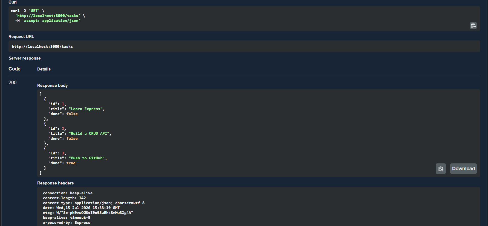
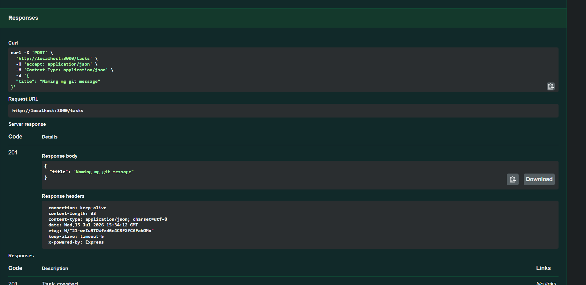
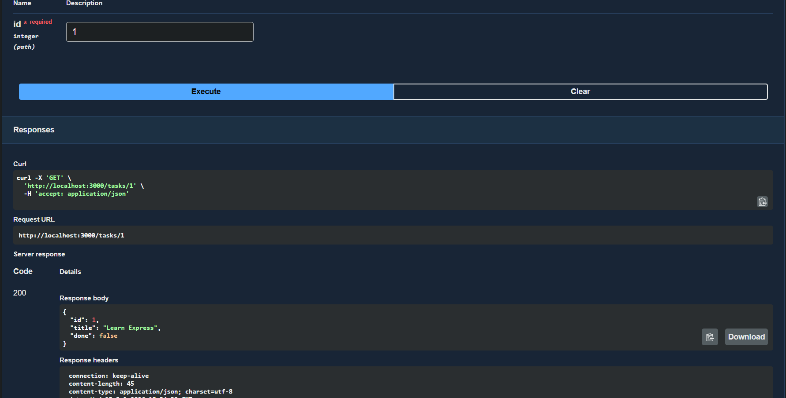
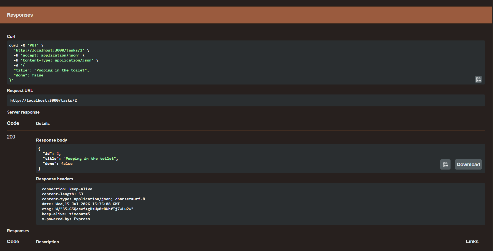
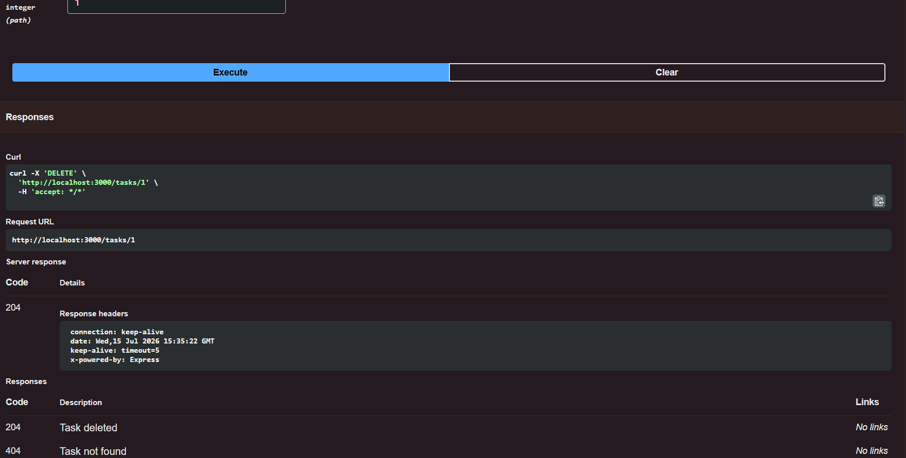

# SampleCRUD

A simple RESTful CRUD API for managing tasks, built with Express.js and documented with Swagger UI.

## Install & Run

```bash
npm install && npm start
```

The server starts on **http://localhost:3000**. Open **http://localhost:3000/docs** for interactive Swagger UI.

## Endpoints

| Method   | Endpoint      | Description              | Body                        |
|----------|---------------|--------------------------|-----------------------------|
| `GET`    | `/tasks`      | List all tasks           | —                           |
| `GET`    | `/tasks/:id`  | Get a task by ID         | —                           |
| `POST`   | `/tasks`      | Create a new task        | `{ "title": "Buy milk" }`   |
| `PUT`    | `/tasks/:id`  | Update a task            | `{ "title": "...", "done": true }` |
| `DELETE` | `/tasks/:id`  | Delete a task            | —                           |

## Example Outputs

### 1. GET `/tasks` (List all tasks)
```
HTTP/1.1 200 OK
Content-Type: application/json

[
  {"id": 1, "title": "Learn Express", "done": false},
  {"id": 2, "title": "Build a CRUD API", "done": false},
  {"id": 3, "title": "Push to GitHub", "done": true}
]
```



### 2. POST `/tasks` (Create a new task)
```
HTTP/1.1 201 Created
Content-Type: application/json

{"title": "Naming mg git message"}
```



### 3. GET `/tasks/:id` (Get a single task)
```
HTTP/1.1 200 OK
Content-Type: application/json

{"id": 1, "title": "Learn Express", "done": false}
```



### 4. PUT `/tasks/:id` (Update a task)
```
HTTP/1.1 200 OK
Content-Type: application/json

{"id": 2, "title": "Pooping in the toilet", "done": false}
```



### 5. DELETE `/tasks/:id` (Delete a task)
```
HTTP/1.1 204 No Content
```



## Swagger UI


Try it out at **http://localhost:3000/docs** for interactive testing.

---